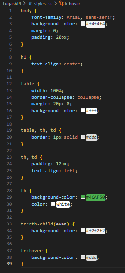
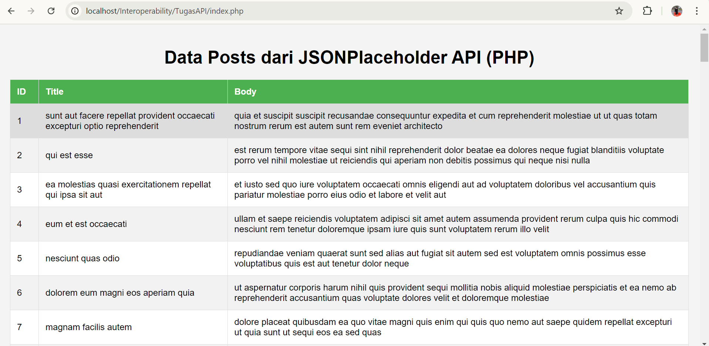
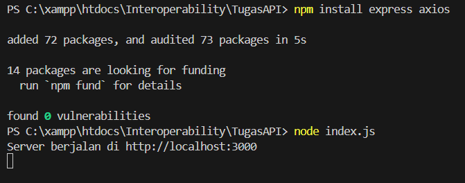
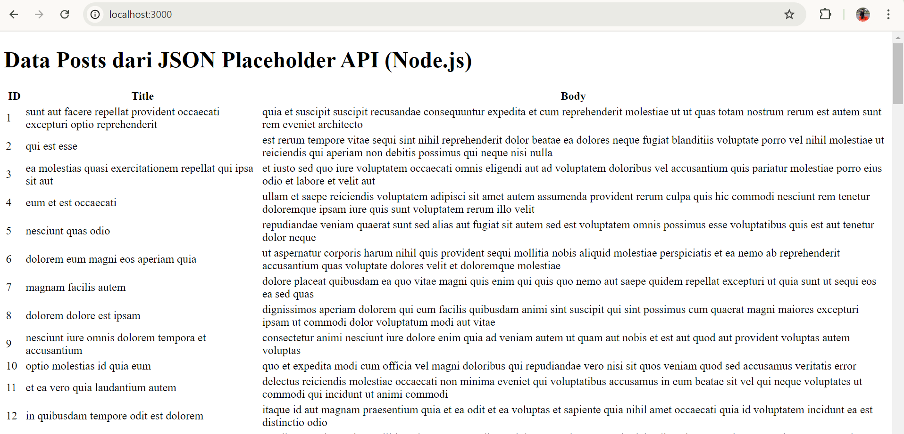
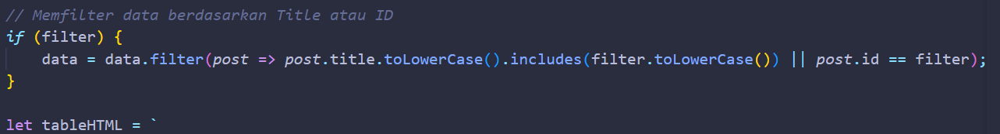
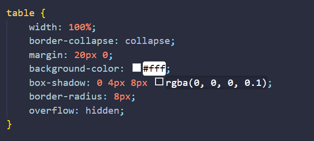
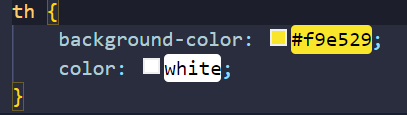

NAMA : MOH. ARBI ARDIANSYAH

NIM : 362358301150

KELAS : 2B TRPL

LAPORAN PRAKTIKUM API: KONSUMSI APIP MENGGUNAKAN PHP DAN Node.js SERTA MENAMPILKAN DATA DALAM TABEL DENGAN CSS

1.Mengambil Data dari API dengan PHP

2.Menampilkan Data dalam Tabel dengan PHP

3.Menambahkan CSS untuk PHP

4.Mengakses Aplikasi PHP

Bagian 2: Konsumsi API Menggunakan Node.js

1.Mengambil Data dari API dengan Node.js

S
2.Menjalankan Server Node.js

3.Mengakses Aplikasi Node.js

TUGAS PRAKTIKUM!
1.Memodifikasi Implementasi untuk Mengambil Data dari Resource Lain
 
PHP:
Saya mengganti resource data lain, yang tadinya /post menjadi /users

Node.js:
Saya mengganti resource data lain, yang tadinya /post menjadi /comment

2.Menambahkan Fitur Filter Data Berdasarkan ‘ID’ atau ‘Title’

PHP:
Menambahkan form di HTML:

Menambahkan logika untuk memfilter data

Node.js:

Menambahkan logika filter di route /:

Memperbaiki Tampilan Tabel dengan Elemen Desain yang Lebih Kreatif di CSS

Menambahkan box-Shadow dan Border Radius

Mengubah warna baris pertama pada tabel untuk kontras:

Menambahkan efek transisi saat baris dihover:

Hasil Setelah di Modifikasi

PHP :

Node.js :

